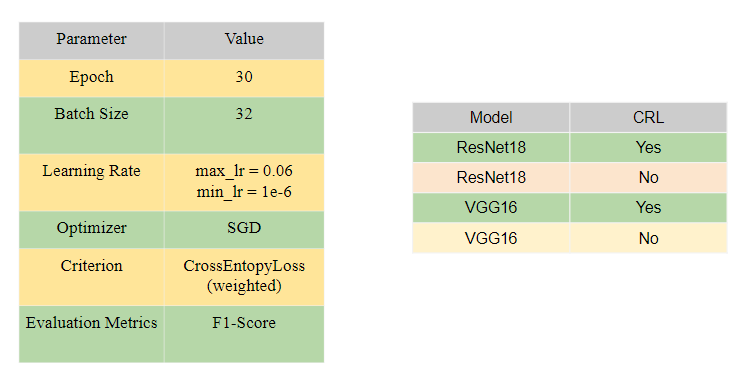

# Predicting_Invasive_Ductal_Carcinoma_in_Tissue_Slices
Predicting Invasive Ductal Carcinoma in Tissue Slices using two pre-trained convolutional neural networks to detect IDC in the tissue slice images

# Final Project Report
## Predicting Invasive Ductal Carcinoma in Tissue Slices
*Yue Li, Hsueh-Yi Lu*
*Advisor: Amir Jafari*
*Fall 2022*
*Dec 13, 2022*


## Table of Contents
1. [Introduction](#introduction)
2. [Description of Dataset](#description-of-dataset)
3. [Description of the Model and Algorithm](#description-of-the-model-and-algorithm)
   - Convolutional Neural Network
   - Transfer Learning
   - Pre-trained Model - VGG
   - Pre-trained Model - ResNet
   - Cyclical Learning Rates (CLR)
   - General Adversarial Network (GAN)
4. [Experimental Setup](#experimental-setup)
   - Data Preprocessing
   - Exploratory Data Analysis (EDA)
   - Train, Validation, and Test Split
   - Data Augmentation
   - Metric Selection
   - Model Selection
   - Learning Rate Search
   - Train Processing
5. [Results & Summary](#results--summary)
6. [Future Work](#future-work)
7. [References](#references)

## Introduction
Introduction
Invasive ductal carcinoma (IDC) is one of the most common types of breast cancer. It's malicious 
and able to form metastases which makes it especially dangerous. Often a biopsy is done to remove 
small tissue samples. Then a pathologist has to decide whether a patient has IDC, another type of 
breast cancer or is healthy. In addition sick cells need to be located to find out how advanced the 
disease is and which grade should be assigned. This has to be done manually and is a time 
consuming process. Furthermore the decision depends on the expertise of the pathologist and his 
or her equipment. Therefore deep learning could be of great help to automatically detect and locate 
tumor tissue cells and to speed up the process. In order to exploit the full potential one could build 
a pipeline using massive amounts of tissue image data of various hospitals that were evaluated by 
different experts. This way one would be able to overcome the dependence on the pathologist 
which would be especially useful in regions where no experts are available.
In the project, we used two pre-trained convolutional neural networks to detect IDC in the tissue 
slice images. In order to avoid the overfitting issue and improve the model performance, we 
implemented two methods. One is data augmentation method and the other is learning rate search 
method. In the data augmentation, methods in the transformer were used to increase the diversity
of the images and a general adversarial network was implemented to standardize the image. In the 
training process, the cyclical learning rate (CLR) search method was used when training the 
Resnet18 and the VGG16 framework. The best performance is the accuracy 0.85 on the test set 
on Resnet18 with CLR search. 

## Description of Dataset
The dataset used in this project is sourced from Kaggle and contains 162 whole mount slide images of Breast Cancer (BCa) specimens scanned at 40x. From these slides, 277,524 patches of size 50x50 were extracted, consisting of 198,738 IDC-negative patches and 78,786 IDC-positive patches.

# Exploratory data analysis


## Description of the Model and Algorithm
- Convolutional Neural Network (CNN): Two pre-trained CNN models, VGG16 and ResNet18, were used for the classification task. CNNs are deep learning algorithms that assign importance to various aspects of an image to differentiate between classes.

 

 
- Transfer Learning: Pre-trained models from ImageNet were used to leverage their learned features and adapt them to the IDC classification task.
- Cyclical Learning Rates (CLR): A learning rate search method was used during the training process to optimize the learning rate between specified boundaries, resulting in improved convergence and stability.


- General Adversarial Network (GAN): A cGAN (conditional GAN) was implemented for data augmentation and color normalization to increase the diversity of images and improve model performance.


## Experimental Setup
Data preprocessing, exploratory data analysis, train-validation-test split, data augmentation, and metric selection were performed to prepare the data and set up the evaluation process.

# Data Augmentation


Image diversity increase

In this project, we did two parts of methods for data augmentation on the train set to avoid 
overfitting and improve the performance. Our dataset is H&E stained Tissue slice dataset. First 
method is increasing image diversity. Second is the standardizing of the color of images, called 
color normalization. In this project, we implemented ‘imguag’ and ‘skimage’. Figure X, is the 
original image. We used several methods to transform images. The examples are shown below.


# Train



| Parameter    | Value  | 
|----------|------|
| Epoch | 30  | 
| Batch Size | 32   | 
| Learning Rate    | max_lr = 0.06， min_lr = 1e-6  |
| Optimizer    | SGD   | 
| Criterion    | CrossEntropyLoss(weighted) | 
| Evaluation Metrics     | F1-Score   | 


## Results & Summary

# Model Performance

| Model    | CRL  | Validation Accuracy | Training Time |
|----------|------|---------------------|---------------|
| ResNet18 | Yes  | 0.85%              | 265m51s       |
| ResNet18 | No   | 0.77%              | 270m41s       |
| VGG16    | Yes  | 0.79%              | 390m44s       |
| VGG16    | No   | 0.73%              | 393m43s       |

# CLR-True


# CLR-Fasle


ResNet18 outperformed VGG16 in terms of accuracy and training time. The use of Cyclical Learning Rates (CLR) improved the stability and convergence speed of both models.

ResNet18 has 25.5 million parameters and VGG16 has around 138 million 
parameters. However, the number of parameters is not the factor that influences the training speed. 
The architecture is. ResNet18 has a large kernel size 7 * 7 at the beginning, it helped to reduce 
the image size to half. Compared with VGG16, the kernel size is 3*3 at the first layer. Therefore, 
it would be more computationally expensive than ResNet18. ResNet18 follows the rule that is 
much thinner and much deeper in the architecture of the network.Cyclic learning rate method 
helped to improve the accuracy on the validation set and converged faster both on VGG16 and 
ResNet18. With the Cyclic learning rate method, the training process was more stable. 

## Future Work
Potential future work includes generating color-normalized images using Pix2Pix network and incorporating them into the training set to further improve model performance.

## References
The report includes a list of references used for the project, covering various sources related to convolutional neural networks, datasets, transfer learning, and GANs.

1. [Convolutional neural networks: an overview and application in radiology](https://link.springer.com/article/10.1007/s13244-018-0639-9) | Insights into Imaging
2. [Breast Cancer Notebook: Breast Cancer](https://www.kaggle.com/paultimothymooney/breast-histopathology-images) | Kaggle
3. [Breast Histopathology Images](https://www.kaggle.com/paultimothymooney/breast-histopathology-images) | Kaggle
4. [ResNet and VGG: Why is resnet faster than vgg](https://stats.stackexchange.com/questions/364882/why-is-resnet-faster-than-vgg) | Cross Validated
5. [Cyclic Learning rate: Super Convergence with Cyclical Learning Rates in TensorFlow](https://towardsdatascience.com/super-convergence-with-cyclical-learning-rates-in-tensorflow-d8a245fd8a4) | by Christopher Thomas BSc Hons. MIAP | Towards Data Science
6. Ibraham, Kandel., Mauro, Castelli., (2020). [The effect of batch size on the generalizability of the convolutional neural networks on a histopathology dataset](https://www.sciencedirect.com/science/article/pii/S2213158220302296). Volume 6, Issue 4, Science Direct.
7. Cruz-Roa, A., Basavanhally, A., González, F., Gilmore, H., Feldman, M., Ganesan, S., Shih, N., Tomaszewski, J., & Madabhushi, A. (2014). [Automatic detection of invasive ductal carcinoma in whole slide images with convolutional neural networks](https://doi.org/10.1117/12.2043872). SPIE Proceedings.
8. [Pix2Pix Kaggle: Stain Transfer w/ Pix2Pix; PyTorch/Lightning](https://www.kaggle.com/mrgravelord/colored-and-stained-histology-mnist) | Kaggle
9. Salehi, P., & Chalechale, A. (2020). [Pix2Pix-based stain-to-stain translation: A solution for robust stain normalization in histopathology images analysis](https://doi.org/10.1109/mvip49855.2020.911689). 2020 International Conference on Machine Vision and Image Processing (MVIP).


## Getting Started

 To get started, you will need to install the following dependencies:
 
```
 Python 3.6+
 PyTorch# Torchvision
 NumPy
 Scikit-learn
```

# Once you have installed the dependencies, you can clone the repository and run the following command to install the project dependencies:

```commandline
  pip install -r requirements.txt
```

## Usage

 To train the models, you can run the following command:
```commandline
 python train.py
```

 This will train the models and save the trained models to the `models` directory.

 To evaluate the models, you can run the following command:

```commandline
  python evaluate.py
```

 This will evaluate the models on the test set and print the accuracy.


